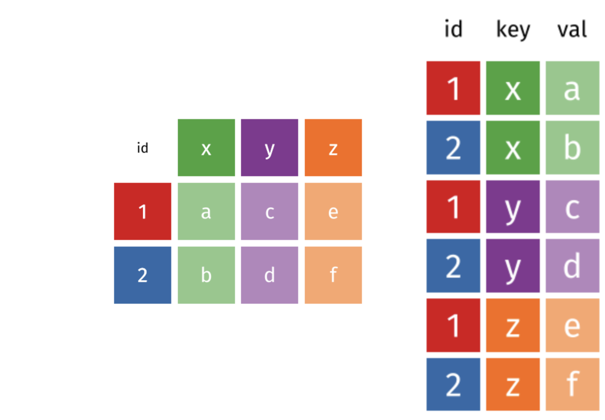

```{r, echo=FALSE, purl=FALSE, message = FALSE}
library(tidyverse)
knitr::opts_chunk$set(results='hide', comment = "#>", purl = FALSE)
trafficstops <- read.csv("data/MS_trafficstops_bw_age.csv")
```

# Data Manipulation using **`tidyr`**{#tidyr}

> Learning Objectives
>
> * Understand the concept of a wide and a long table format and for which purpose those formats are useful.
> * Understand what key-value pairs are.
> * Reshape a data frame from long to wide format and back with the `spread` and `gather` commands from the **`tidyr`** package.
> * Export a data frame to a .csv file.


`dplyr` pairs nicely with **`tidyr`** which enables you to swiftly convert between different data formats for plotting and analysis.

The package **`tidyr`** addresses the common problem of wanting to reshape your data for plotting and use by different R functions. Sometimes we want data sets where we have one row per observation. Sometimes we want a data frame where each observation type has its own column, and rows are instead more aggregated groups - like surveys, where each column represents an answer. Moving back and forth between these formats is nontrivial, and **`tidyr`** gives you tools for this and more sophisticated  data manipulation.

To learn more about **`tidyr`** after the workshop, you may want to check out this [cheatsheet about **`tidyr`**](https://github.com/rstudio/cheatsheets/blob/master/source/pdfs/data-import-cheatsheet.pdf).

## About long and wide table format

The 'long' format is where:

 - each column is a variable
 - each row is an observation

In the 'long' format, you usually have 1 column for the observed variable and
the other columns are ID variables.


For the 'wide' format each row is often a site/subject/patient and you have
multiple observation variables containing the same type of data. These can be
either repeated observations over time, or observation of multiple variables (or
a mix of both). You may find data input may be simpler or some other
applications may prefer the 'wide' format. However, many of `R`'s functions have
been designed assuming you have 'long' format data. This tutorial will help you
efficiently transform your data regardless of original format.

```{r wide-vs-long, echo=FALSE, results='asis', out.width='30%', fig.cap='Wide vs. Long Table Format', eval=TRUE}

```

The choice of data format affects readability. For humans, the wide format is often more intuitive, since we can often see more of the data on the screen due to its shape. However, the long format is more machine readable and is closer to the formatting of databases. The `ID` variables in our dataframes are similar to the fields in a database and observed variables are like the database values.


> Challenge 1
>
> Is trafficstops in a long or wide format?
>

## Long to Wide with `spread`

Now let's see this in action. First, using **`dplyr`**, let's create a data frame
with the mean age of each driver by gender and county:

```{r, results='show', purl=FALSE}
trafficstops_ma <- trafficstops %>%
    filter(!is.na(driver_gender)) %>%
    group_by(county_name, driver_gender) %>%
    summarize(mean_age = mean(driver_age, na.rm = TRUE))

head(trafficstops_ma)
```


Now, to make this long data wide, we use `spread` from `tidyr` to spread out the
driver gender into columns. `spread` takes three arguments - the data, the
*key* column, or column with identifying information, the *values* column - the
one with the numbers. We'll use a pipe so we can ignore the data argument.

```{r, results='show', purl=FALSE}
trafficstops_ma_wide <- trafficstops_ma %>%
  spread(driver_gender, mean_age) 

head(trafficstops_ma_wide)
```

We can now do things like compare the mean age of men against women drivers. As example we use the age difference to find the counties with the largest and with the smallest number. (A negative number means that female drivers are on average older than male drivers, a positive number means that male drivers are on average older than women drivers.)

```{r, results='show', purl=FALSE}
trafficstops_ma_wide %>% 
  mutate(agediff = male - female) %>% 
  ungroup() %>%
  filter(agediff %in% range(agediff))
```

Note that `trafficstops_ma_wide` is derived from `trafficstops_ma`, and is a "grouped" data frame, which was created with the `group_by` function above. (Check `class(trafficstops_ma)` and `class(trafficstops_ma_wide)`). That means that any instruction that follows will operate on each group (in this case county) separately. That may be ok for some instances (like `mutate`), but if we are interested in retreiveing the max and the min age difference over all counties we need to `ungroup` the tibble to have the `filter` command operate on the entire dataset. 


## Wide to long with `gather`

What if we had the opposite problem, and wanted to go from a wide to long
format? For that, we use `gather` to sweep up a set of columns into one
key-value pair. We give it the arguments of a new key and value column name, and
then we specify which columns we either want or do not want gathered up. So, to
go backwards from `trafficstops_ma_wide`, and exclude `plot_id` from the gathering,
we would do the following:

```{r, results='show', purl=FALSE}
trafficstops_ma_long <- trafficstops_ma_wide %>%
  gather(gender, mean_age, -county_name)

head(trafficstops_ma_long)
```

We could also have used a specification for what columns to include. This can be
useful if you have a large number of identifying columns, and it's easier to
specify what to gather than what to leave alone. And if the columns are in a
row, we don't even need to list them all out -- just use the `:` operator!

```{r, results='show', purl=FALSE}
trafficstops_ma_wide %>%
  gather(gender, mean_age, female:male) %>% 
  head()
```

> <h3>Challenge</h3>
>
> 1. Make a wide data frame with `year` as columns, `violation_raw` as rows, and the values are the number of traffic stops per each violation. Use year() from the lubridate package. You will need to summarize before reshaping
>
> 2. Now take that data frame, and make it long again, so each row is a unique
>    `violation_raw` `year` combination.
>

```{r, eval=FALSE, purl=TRUE, echo=FALSE}
## Reshaping challenges

## 1.  Make a wide data frame with `year` as columns, `violation_raw` as rows, and the values are the number of traffic stops per each violation. Use year() from the lubridate package. You will need to summarize before reshaping.

## 2. Now take that data frame, and make it long again, so each row is a unique `violation_raw` `year` combination.

```

<!---
  ```{r, echo=FALSE, purl=FALSE}
## Answer 1
library(lubridate)
tr_wide <- trafficstops %>%
  mutate(year = year(ymd(stop_date))) %>% 
  group_by(violation_raw, year) %>%
  summarize(n_stops = n()) %>%
  spread(year, n_stops)

head(tr_wide)

## Answer 2
tr_wide %>%
  gather(year, n_stops, -violation_raw)
```
--->

Now that you have those commands under your belt, let's go back to our table from before and reshape it so we can easily calculate the percentage of black and white. To clean things up a little, we remove rows where driver race is unknown. 

We then make sure that we count our `NA`s as `0`.  We know from earlier that in Tunica County all reported stops are for black drivers (Check again with: ` trafficstops %>% filter(county_name == "Tunica County")`). By default spread would set the value for white stops to NA. Sometimes it is fine to leave those as NA. Sometimes we want to fill them as zeros, in which case we would add the argument `fill = 0`. In our case we prefer to count this a 0. 

 Lastly, we introduce a separator (`sep`) as parameter to the spread command. If `sep` is not `NULL`, the column names will be given by `"<key_name><sep><key_value>"` and make them more explicit, easier for you to interpret, and for anyone who might use your data. 

```{r, results='show', eval=FALSE}
trafficstops %>% 
  filter(!is.na(driver_race)) %>% 
  count(county_name, county_fips, driver_race) %>% 
  spread(driver_race, n, fill = 0, sep = "_") %>% 
  head()
```


Now we can pipe this into our left join and calculate the percentages:

```{r, results='show'}
# make sure you this table loaded:
MS_bw_pop <- read.csv("data/MS_acs2015_bw.csv")

trafficstops %>% 
  filter(!is.na(driver_race)) %>% 
  count(county_name, county_fips, driver_race) %>% 
  spread(driver_race, n, fill = 0, sep = "_") %>%  
  left_join(MS_bw_pop, by = c("county_fips" = "FIPS")) %>% 
  mutate(pct_black_stopped = driver_race_Black/black_pop,
         pct_white_stopped = driver_race_White/white_pop) %>% 
  print(n=5, width=Inf)
```

Terrific. 

Now let's use some visualization to help us understand our data. Before we do this though, let's save this table out. 


## Exporting data 

Instead of printing the above output to the screen we will pipe it into another command. Similar to the `read.csv()` function used for reading CSV files into R, there is a `write.csv()` function that generates CSV files from data frames.

Before using `write.csv()`, we are going to create a new folder, `data_output`,
in our working directory that will store this generated dataset. We don't want
to write generated datasets in the same directory as our raw data. It's good
practice to keep them separate. The `data` folder should only contain the raw,
unaltered data, and should be left alone to make sure we don't delete or modify
it. In contrast, our script will generate the contents of the `data_output`
directory, so even if the files it contains are deleted, we can always
re-generate them.

We can save the table generated by the join as a CSV file in our `data_output`
folder. By default, `write.csv()` includes a column with row names (in our case
the names are just the row numbers), so we need to add `row.names = FALSE` so
they are not included:

```{r, purl=FALSE, eval=FALSE}
trafficstops %>% 
  filter(!is.na(driver_race)) %>% 
  count(county_name, county_fips, driver_race) %>% 
  spread(driver_race, n, fill = 0, sep = "_") %>%  
  left_join(MS_bw_pop, by = c("county_fips" = "FIPS")) %>% 
  mutate(pct_black_stopped = driver_race_Black/black_pop,
         pct_white_stopped = driver_race_White/white_pop) %>% 
  write.csv(file = "data_output/MS_demographic.csv", row.names = FALSE)
```

```{r, purl=FALSE, echo=FALSE}
if (!file.exists("data_output")) dir.create("data_output")

trafficstops %>% 
  filter(!is.na(driver_race)) %>% 
  count(county_name, county_fips, driver_race) %>% 
  spread(driver_race, n, fill = 0, sep = "_") %>%  
  left_join(MS_bw_pop, by = c("county_fips" = "FIPS")) %>% 
  mutate(pct_black_stopped = driver_race_Black/black_pop,
         pct_white_stopped = driver_race_White/white_pop) %>% 
  write.csv(file = "data_output/MS_demographic.csv", row.names = FALSE)
```

